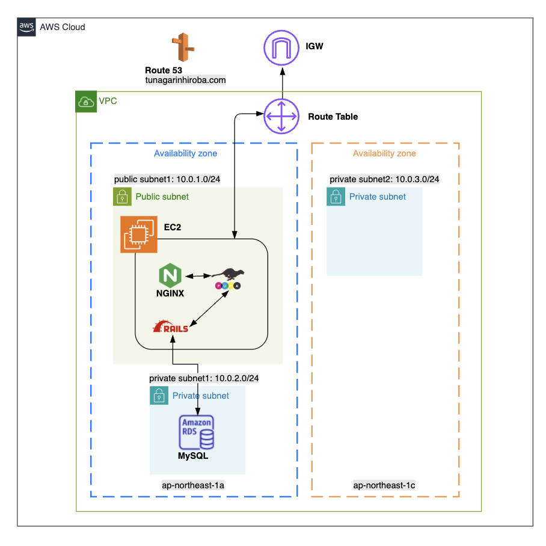
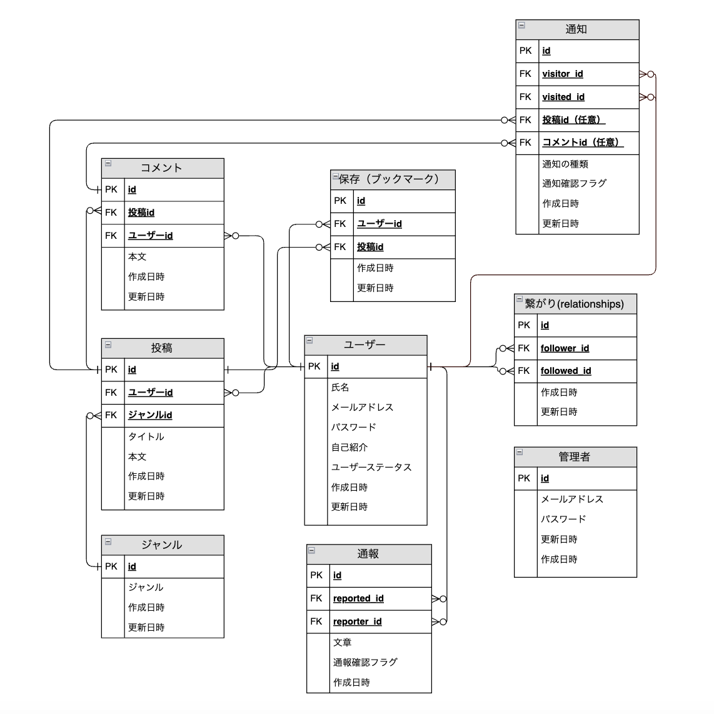

# つながり広場
## サイト概要
### サイトテーマ
病気と共に生きる人々が、日常の工夫や経験を共有できるSNSサイト
​
### テーマを選んだ理由
病気に直面した当事者や家族の乗り越える工夫を共有するアプリを作りたいと思いました。
医療の現場に携わる中で、病気はともに歩みながら乗り越えていくもので、その家族にも葛藤があるという現実に直面しました。
病気を告げられた時の本人や家族のショックは計り知れません。それを乗り越えていくプロセスや、共に乗り越える仲間がいれば、これから病気になる人や、共に病気と歩んでいる人の支えになると思いました。
※本サービスは診断結果や病名の投稿を任意とし、医療的判断を促すものではありません。あくまで日常の中での工夫や気づきを共有することを目的としています。

### ターゲットユーザ
- 病気を抱えている人
- 病気を抱えている親族や友人、パートナー
​
### 主な利用シーン
- 病気を診断された時
- 家族、パートナー、友人が病気を抱えた時
- 病気が完治した時
- 慢性疾患でずっと付き合っていくことになった時
- 認知症予防
- 子供が発達障害を診断された時
- 精神疾患を抱えている人

## 機能一覧
- 保存機能
  - 保存数は非表示とし、競争を生まない構造にすることで心理的安全性を担保（※フォロー数、コメント数も同様。いいね機能は本目的と相反するため未採用）
- コメント機能
- 応援（フォロー）機能
  - 表示名を「フォロー」ではなく「応援する」とし、インターネット利用に不慣れな高齢者層にも直感的に伝わる構成
- 通知機能
- ジャンル機能
  - タグに馴染みのないユーザーにも配慮し、選択式の「ジャンル」機能を採用
- 検索機能
  - 投稿内容、アカウント名、ジャンルの部分一致検索に対応
- 通報機能
  - アカウント単位で通報が可能。3回通報されると自動的に利用停止処理を実行
- ユーザー管理機能
  - 管理者は投稿・コメントの削除、通報内容の確認、アカウントの停止・解除（ステータス管理）が可能
- ゲストログイン
  - 投稿一覧（検索機能）のみ閲覧可能とし、投稿内容を事前に確認できる構成で登録の心理的ハードルを軽減
ユーザープロフィールは非公開とし、登録者のプライバシー保護にも配慮
- レスポンシブデザイン

## 開発環境
- OS：Amazon Linux 2
- フロントエンド：HTML / CSS / Sass / Bootstrap / JavaScript / jQuery
- バックエンド：Ruby on Rails
- 言語：Ruby / SQL / HTML / CSS / JavaScript
- 認証：Devise

## インフラ構成
- インフラ：AWS（EC2, RDS）
- データベース：MySQL（Amazon RDS）
- デプロイ環境：Nginx + Puma
- ドメイン管理：Route 53（`tunagarihiroba.com`）
- HTTPS接続：Let's Encrypt + Certbot によるSSL証明書の自動更新
- 監視：CloudWatch によるEC2インスタンスのステータス監視とアラート設定
- インフラ構成図：

## ER図
